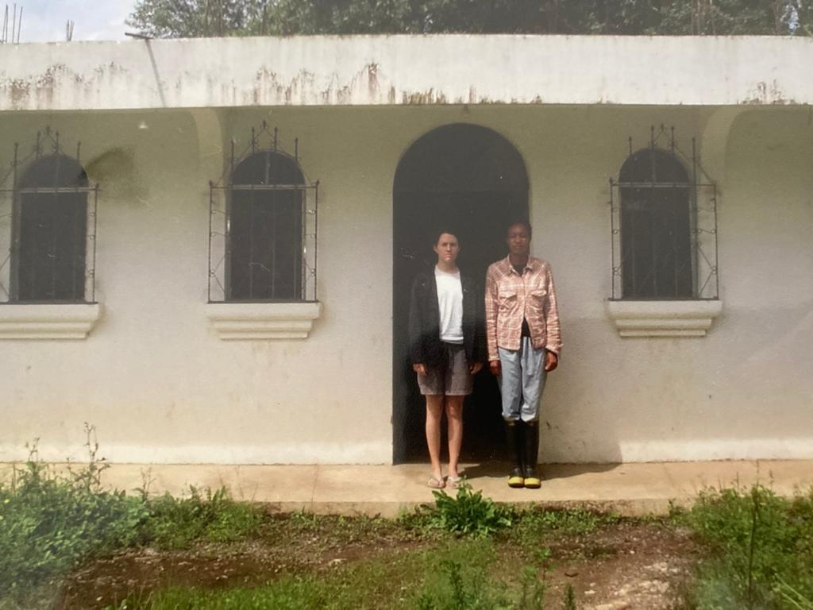
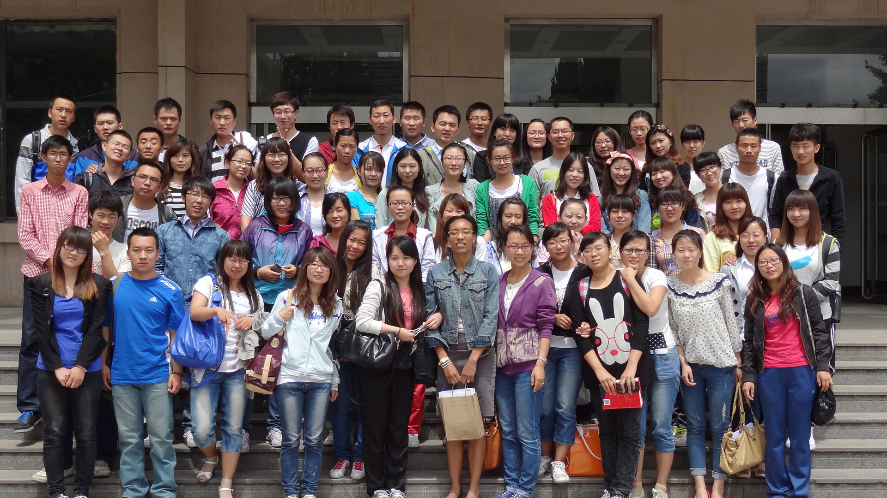

My name is Shellye Suttles. I am an agricultural economist who enjoys both community-engaged local food system research and using computable general equilibrium (CGE) models to study global food and agricultural issues.

### My story

I was born and raised in Los Angeles, California. I attended the University of Southern California as an undergraduate student and completed a bachelor’s degree in Environmental Studies Biology. 

After graduation, I joined the Peace Corps as a sustainable agriculture and livestock volunteer in Santa María Visitación, Sololá, Guatemala working in conjunction with Children’s Fund. 

I very much enjoyed my agricultural volunteer service with Peace Corps and joined the master’s program in Purdue’s Department of Agricultural Economics to further my knowledge of agricultural issues with an emphasis on economics. 

My master’s thesis focused on gender differences in business goals and management strategies of family business managers in the United States and Canada. After completion of my master’s degree, I continued in the department’s doctoral program as a United States Department of Agriculture (USDA) National Needs Fellow in the Economics of Alternative Energy. 

After completing my doctoral dissertation, I joined the USDA’s Economic Research Service (ERS) as an agricultural economist in the Rural and Resource Economics Division. At ERS, my research focused on food and agricultural policy pertaining to local food systems, energy, and climate change. 

Upon returning to Indiana, I felt it was important to become involved in food and agricultural issues beyond academic research and joined the City of Indianapolis’s Office of Public Health and Safety as Food Policy and Program Coordinator. 

After my informative experience as a local food policy practitioner with the City of Indianapolis, I returned to food system research at Indiana University Bloomington (IUB). I began my time at IUB at the Ostrom Workshop's Sustainable Food Systems Science as an assistant research scientist. I am currently an assistant professor with the O'Neill School of Public & Environmental Affairs (SPEA).
