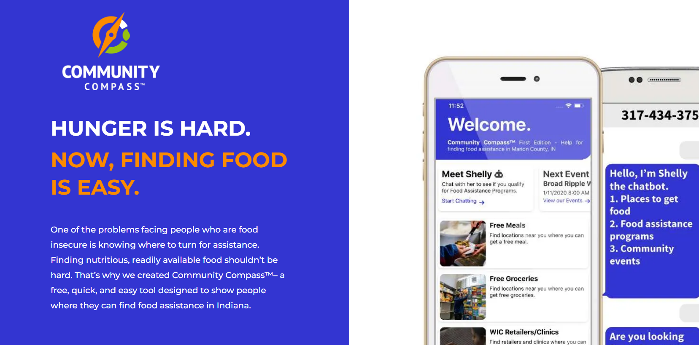

## Felege Hiywot Center

I am a board member and finance chair of the [Felege Hiywot Center (FHC)](https://fhcenter.org/). FHC is a youth-led urban farm in Indianapolis, Indiana.

## Indy Hunger Network

I am a board member, board secretary, and projects committee chair of [Indy Hunger Network (IHN)](https://www.indyhunger.org/). IHN is a collective-impact hunger relief organization in Central Indiana.

Please check out IHN's [Community Compass](https://www.communitycompass.app/) app to help find food and nutrition assistance in Indiana.

## Marion County Farm Bureau

I am a board member and urban agriculture chair of the Marion County Farm Bureau (MCFB). MCFB is a grassroots agriculture advocacy organization in Marion County, Indiana.
