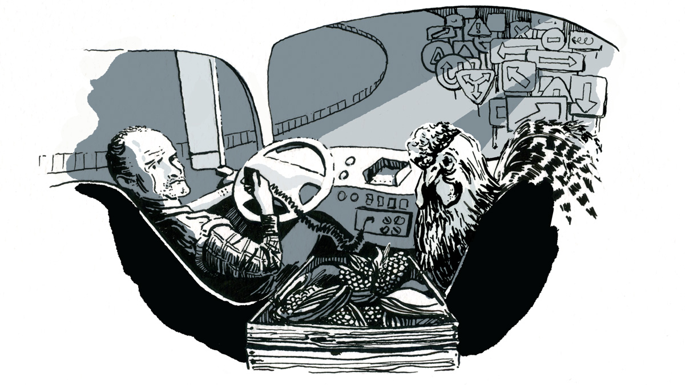

## Agricultural Transportation

In December 2019, the U.S. Federal Motor Carrier Safety Administration mandated electronic logging devices (ELDs) in most commercial motor vehicles. The mandate's goal was the better enforcement commercial drivers driving beyond the hours-of-service limits to deliver shipments faster. We have been exploring the ELD mandate's impact on agricultural shipments, particularly highly perishable refrigerated agricultural products.

*Illustration courtesy of [Anita B.](https://www.anitabilan.com/)*

Published research:
- [Transportation Safety Regulations via the Electronic Logging Device Mandate Can Affect Fresh Produce Shipment Costs](https://www.choicesmagazine.org/choices-magazine/submitted-articles/transportation-safety-regulations-via-the-electronic-logging-device-mandate-can-affect-fresh-produce-shipment-costs) (2021)
- [Food and Agricultural Transportation Challenges Amid the COVID-19 Pandemic](https://www.choicesmagazine.org/choices-magazine/theme-articles/covid-19-and-the-agriculture-industry-labor-supply-chains-and-consumer-behavior/food-and-agricultural-transportation-challenges-amid-the-covid-19-pandemic) (2020)
- [The Electronic Logging Device Mandate and the COst for Refrigerated Citrus](https://edis.ifas.ufl.edu/publication/FE1086) (2020)

## Indianapolis Food Policy Plan

In 2020-21, IU Sustainable Food Systems Science partnered with Butler University and CollaboXD to develop a 25-year food plan for the City of Indianapolis. Given the COVID-19 pandemic, the project moved to virtual community engagement, data collection, and reporting. The largely virtual effort was branded as Food Comida Rawl 317.

The Food Comida Rawl 317 project has served as a connector and a way for  food system stakeholders to understand the diversity of eaters and experiences in Indianapolis and Marion County. Using social science based data collection and analysis, Food Comida Rawl 317 served as a hub of information gathering, sharing, and engagement for individuals and organizations in the local food system.

The project was funded by the City of Indianapolis's Office of Public Health & Safety.

For more information on the project, please visit: [http://foodcomidarawl317.com/](http://foodcomidarawl317.com/)
